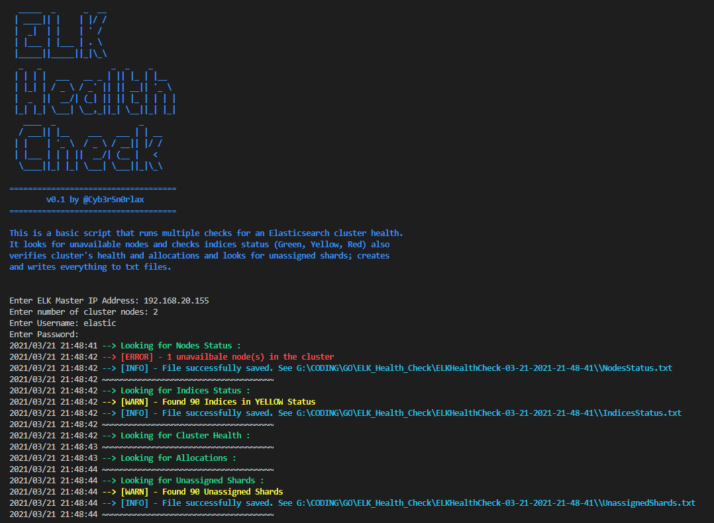

# ELK_Health_Check
 This was a little project for me to start learning GoLang for the first time. That is why my code is so messy :D 

This is a basic script that runs multiple checks for an Elasticsearch cluster health ans saves everything to text files. The script runs the following checks :
1. Unavailable nodes based on the number of nodes you provide in your cluster. 
2. Checks indices status (Green, Yellow, Red). Warns you if it detects Yellow indices or Red ones.
3. Verifies cluster's health using `_cluster/health` API call.
4. Checks allocations status `_cat/allocation` API call 
5. Looks and warns you for unassigned shards; 
6. Creates a directory from where it was run and saves every output to files.
